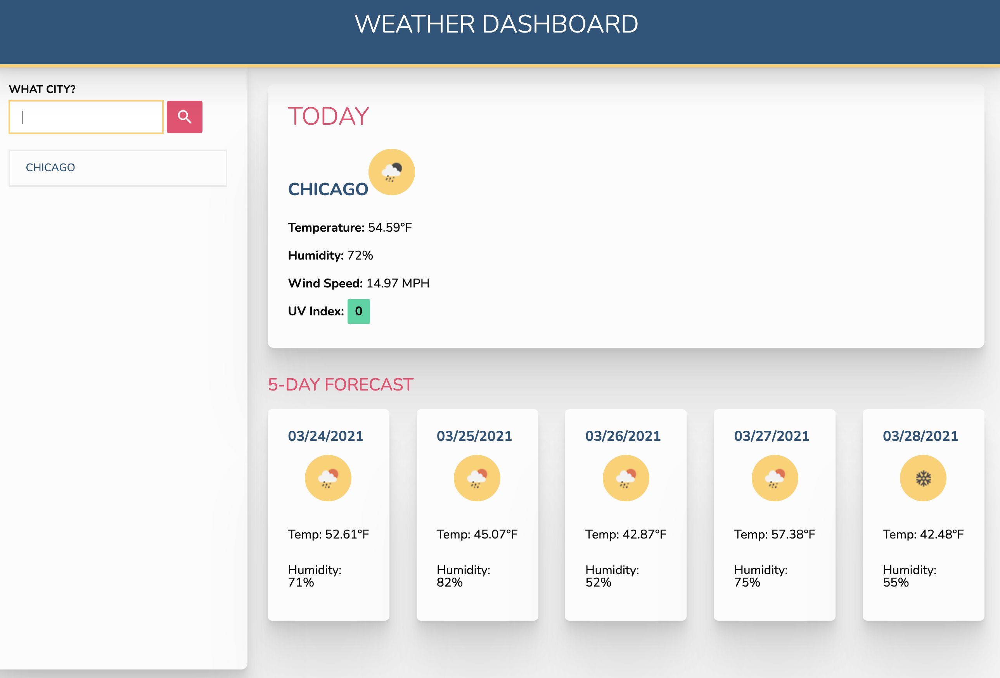

# JS Weather Dashboard

## Project URL

[Github Pages](https://drewole.github.io/js-weather-dash/)

Quick dashboard that pulls API data from two different sources. One to get coordinates for a city search. Another to get the weather with those coordinates. Also pulled in Moment.js for some Unix time stamp conversion.

### Built With

<!-- * [Bootstrap](https://getbootstrap.com) -->
<!-- * [FontAwesome](https://fontawesome.com) -->
<!-- * [MySQL](https://mysql.com) -->
* HTML
* Javascript
* CSS
* [Open Weather API](https://openweathermap.org/api)
